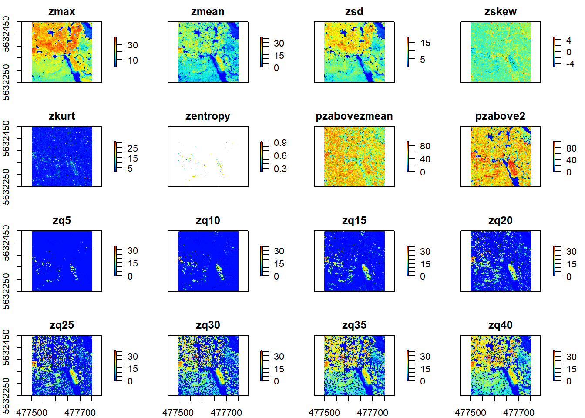
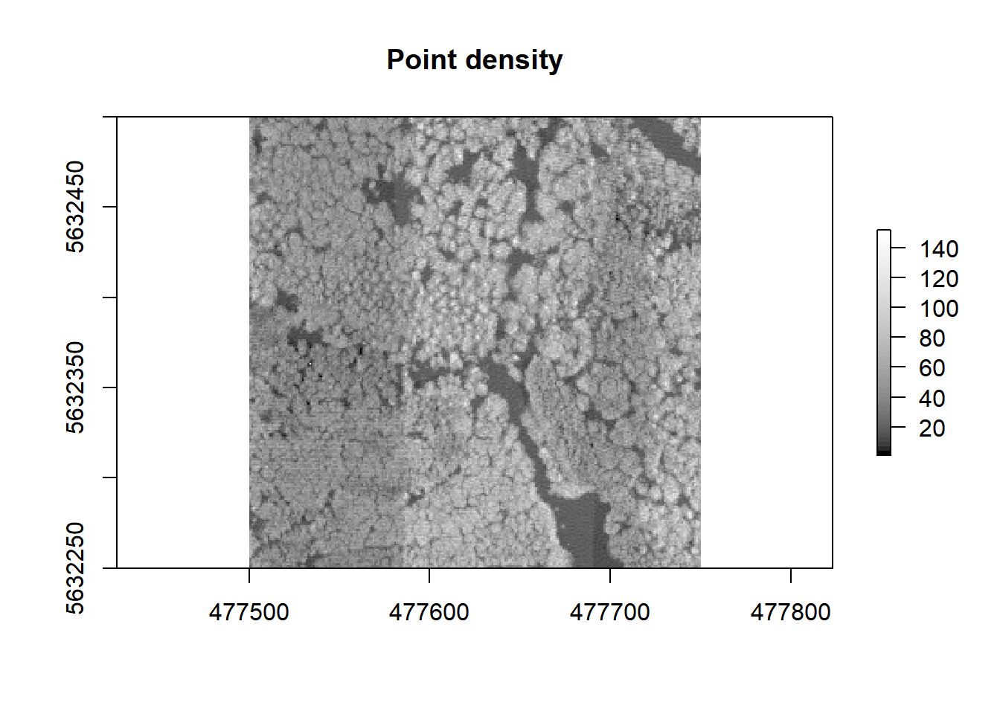

## Assessment: LiDAR based Forest Indices

The task of this Assessment is as follows: 

- Read the ressources related to forest and identify those which you will use for attempting the task.
- Decide which algorithms and indices are adequate to answer the research question
- Apply and document this findings with on base of the scripts of the this unit experiences

The research question we are concerned with is as follows: 

Is it possible to derive a suitable set of predictor variables from LiDAR data to obtain a reliable prediction of the microclimate parameters temperature and humidity?


## Read the ressources related to forest and identify those which you will use for attempting the task and decide which algorithms and indces are adequate to answer the research question.

I think the paper of del Río et al. (2016) provides a good review of different measures, indices and methods to characterize the structure of mixed stands, which is a very important factor for the determination of the microclimate. Table 1 on page 26 to 28 shows a lot of indices for characterizing stand structure at stand level in mixed-species stands. These indices are not especially for LiDAR data, but I think some of them could be derived from LiDAR data. 

The stand structure is one of the most important components, which influences the microclimate parameters. So, the stand density can be used to determine the stand structure and numerous measures are used to determine the stand density. A common way and the easiest to describe stand density is the basal area (BA)(del Rio et al. 2016).
The leaf area index (LAI)is also a stand density variable and can be useful to predict the microclimate. Also the stand density index (SDI), which is a common measure for stand density, can be useful to predict the microclimate. The SDI indicates the tree number for a reference quadratic mean diameter (del Rio et al. 2016).
The horizontal spatial pattern is an important attribute of stand structure and  could be also useful to predict the microclimate, because it directly influences many ecological processes in forest ecosystems, including the microclimate parameters. One important measure of the horizontal spatial pattern is the Clark and Evans aggregation index (R). But also the vertical stand structure is an important parameter for the determination of the forest microclimate. To determine the vertical stand structure the tree hight is an important size variable and can be used to descirbe the vertical structure of a stand.Another measure to describe the vertical stand structure is the foliage height diversity (FHD). The FHD based on the proportion of leaf area within various height intervals above ground (del Río et al.2016).

Hashimoto et al. (2004) also used the indices for determine the vertical and horizontal diversity of forest structure. The indices should be estimated from airbone laser scanning data. I think these indices can also be estimated from LiDAR data. As already mentioned above they also use the foliage height diversity (FHD), calculated by five layers (FHD5) and four layers (FHD4). The more equal the proportion of vegetation coverage at every height, the higher the FHD (Hashimoto et al.2004).With the FHD it is maybe possible to predict the microclimate parameters of each vertical storey. 
They also mentioned the crown patchness (CP), which is an index considered both the vertical and horizontal diversity of foliage distribution (Hashimoto et al. 2004).

Another paper of Greiser et al.(2018) deals with microclimate studies in a managed boreal forest landscape. They quantified the influence of vegetation features and physiography on understory temperatures. The study shows that during the warm season, where the microclimate variability is largest, the both indices canopy cover and basal area were the most important microclimate drivers for especially the minimum and maximum temperatures. The physiographic drivers, especially elevation, dominated maximum temperatures during autumn and early winter (Greiser et al. 2018).So it can also be useful to use a digital elevation model (DEM) to predict the microclimate parameters in a forest, especially as mentioned above in the seasons when deciduous trees have no leaves.


## Apply and document this findings with on base of the scripts of the this unit experiences

The paper of Roussel et al. (2021) deals with the usage of the lidR-package and especially from chapter 8 with derived metrics, which can be used for this task. 


```r
# 0 - specific setup
#-----------------------------
knitr::knit_global()
```

```
## <environment: R_GlobalEnv>
```

```r
require(envimaR)
```

```
## Lade nötiges Paket: envimaR
```

```r
# MANDANTORY: defining the root folder DO NOT change this line
rootDIR = "D:/MSc_Physische_Geographie/GIS/edu/agis"

# define  additional packages
appendpackagesToLoad = c("lidR")
# define additional subfolders
appendProjectDirList =  c("data/lidar_org/normalized/")


# MANDANTORY: calling the setup script also DO NOT change this line
source(file.path(envimaR::alternativeEnvi(root_folder = rootDIR),"src/agis_setup.R"), 
       echo = FALSE,
       local = knitr::knit_global())
```

```
## variable alt_env_id is NOT defined
##  'COMPUTERNAME' is set by defaultvariable alt_env_value is NOT defined
##  'PCRZP' is set by defaultvariable alt_env_root_folder is NOT defined
##  'F:/BEN/edu' is set by default
```

```
## Lade nötiges Paket: mapview
```

```
## Lade nötiges Paket: mapedit
```

```
## Lade nötiges Paket: tmap
```

```
## Registered S3 methods overwritten by 'stars':
##   method             from
##   st_bbox.SpatRaster sf  
##   st_crs.SpatRaster  sf
```

```
## Lade nötiges Paket: raster
```

```
## Lade nötiges Paket: sp
```

```
## Lade nötiges Paket: sf
```

```
## Linking to GEOS 3.9.1, GDAL 3.2.1, PROJ 7.2.1
```

```
## Lade nötiges Paket: dplyr
```

```
## 
## Attache Paket: 'dplyr'
```

```
## Die folgenden Objekte sind maskiert von 'package:raster':
## 
##     intersect, select, union
```

```
## Die folgenden Objekte sind maskiert von 'package:stats':
## 
##     filter, lag
```

```
## Die folgenden Objekte sind maskiert von 'package:base':
## 
##     intersect, setdiff, setequal, union
```

```
## Lade nötiges Paket: tidyverse
```

```
## -- Attaching packages --------------------------------------- tidyverse 1.3.1 --
```

```
## v ggplot2 3.3.5     v purrr   0.3.4
## v tibble  3.1.5     v stringr 1.4.0
## v tidyr   1.1.4     v forcats 0.5.1
## v readr   2.0.2
```

```
## -- Conflicts ------------------------------------------ tidyverse_conflicts() --
## x tidyr::extract() masks raster::extract()
## x dplyr::filter()  masks stats::filter()
## x dplyr::lag()     masks stats::lag()
## x dplyr::select()  masks raster::select()
```

```
## Lade nötiges Paket: RStoolbox
```

```
## Lade nötiges Paket: randomForest
```

```
## randomForest 4.6-14
```

```
## Type rfNews() to see new features/changes/bug fixes.
```

```
## 
## Attache Paket: 'randomForest'
```

```
## Das folgende Objekt ist maskiert 'package:ggplot2':
## 
##     margin
```

```
## Das folgende Objekt ist maskiert 'package:dplyr':
## 
##     combine
```

```
## Lade nötiges Paket: e1071
```

```
## 
## Attache Paket: 'e1071'
```

```
## Das folgende Objekt ist maskiert 'package:raster':
## 
##     interpolate
```

```
## Lade nötiges Paket: caret
```

```
## Lade nötiges Paket: lattice
```

```
## 
## Attache Paket: 'caret'
```

```
## Das folgende Objekt ist maskiert 'package:purrr':
## 
##     lift
```

```
## Lade nötiges Paket: lidR
```

```r
# 1 - start script
#-----------------------------

#read a small .las file from the already existing las-catalog

las <- readLAS(file.path(envrmt$path_data, "10_norm.las"))

epsg_number = 25832

crs(las) <- epsg_number

las
```

```
## class        : LAS (v1.3 format 1)
## memory       : 224.4 Mb 
## extent       : 477500, 477750, 5632250, 5632500 (xmin, xmax, ymin, ymax)
## coord. ref.  : ETRS89 / UTM zone 32N 
## area         : 62498.92 m²
## points       : 2.94 million points
## density      : 47.06 points/m²
```

I start to calculate the metrics at the cloud level, which are using all available points. 


```r
#calculate the mean height

cloud_metrics(las, func = ~mean(Z))
```

```
## [1] 14.54
```

```r
#Now calculate a few other metrics. The computed metrics are returned as a list.

metrics <- cloud_metrics(las, func = .stdmetrics_z)
head(metrics)
```

```
## $zmax
## [1] 39.639
## 
## $zmean
## [1] 14.54
## 
## $zsd
## [1] 11.47443
## 
## $zskew
## [1] -0.0861508
## 
## $zkurt
## [1] 1.545214
## 
## $zentropy
## [1] NA
```

It is also possible to derive the metrics at the grid level.
For example, to calculate the average height (mean(Z)) of all points within 1 x 1 m pixels


```r
hmean <- grid_metrics(las, ~mean(Z), 1) # calculate mean at 1 m

plot(hmean, col = height.colors(50))
```


```r
hmean
```

```
## class      : RasterLayer 
## dimensions : 250, 250, 62500  (nrow, ncol, ncell)
## resolution : 1, 1  (x, y)
## extent     : 477500, 477750, 5632250, 5632500  (xmin, xmax, ymin, ymax)
## crs        : +proj=utm +zone=32 +ellps=GRS80 +towgs84=0,0,0,0,0,0,0 +units=m +no_defs 
## source     : memory
## names      : V1 
## values     : -0.200913, 37.01462  (min, max)
```

The stdmetrics()-function contains metrics that summarize the vertical distribution of points, their intensities, and return structure.

```r
metrics <- grid_metrics(las, .stdmetrics, 10) # calculate standard metrics
plot(metrics, col = height.colors(50))
```



With the grid metrics it is also possible to calculate the density. The point density  is the number of points within a pixel divided by the area of the pixel (Roussel et al. 2021).


```r
density <- grid_metrics(las, ~length(Z)/1, 1) # calculate density
plot(density, col = gray.colors(50,0,1)) # some plotting
```



Next I will use the derived metrics at the voxel level.


```r
vox_met <- voxel_metrics(las, ~list(N = length(Z)), 4) # calculate voxel metrics

plot(vox_met, color="N", colorPalette = heat.colors(50), size = 4, bg = "white", voxel = T)
```

As mentioned in Greiser et al. (2018) the elevation can influence the microclimate parameters. Because of that I will generate a digital terrain model (DTM).

```r
dtm <- grid_terrain(las, res = 1.0, algorithm = lidR::knnidw(k = 6L, p = 2))
```

```
## Warning: There were 3 degenerated ground points. Some X Y coordinates were
## repeated but with different Z coordinates. min Z were retained.
```

```r
dtm
```

```
## class      : RasterLayer 
## dimensions : 250, 250, 62500  (nrow, ncol, ncell)
## resolution : 1, 1  (x, y)
## extent     : 477500, 477750, 5632250, 5632500  (xmin, xmax, ymin, ymax)
## crs        : +proj=utm +zone=32 +ellps=GRS80 +towgs84=0,0,0,0,0,0,0 +units=m +no_defs 
## source     : memory
## names      : Z 
## values     : -0.219, 0.303  (min, max)
```


## References

- del Río, M., Pretzsch, H., Alberdi, I., Bielak, K., Bravo, F., Brunner, A., Condés, S., Ducey, M.J., Fonseca, T., von Lüpke, N., Pach, M., Peric, S., Perot, T., Souidi, Z., Spathelf, P., Sterba, H., Tijardovic, M., Tomé, M., Vallet, P. & Bravo-Oviedo, A. (2016): Characterization of the structure, dynamics, and productivity of mixed-species stands: review and perspectives. Eur. J. Forest Res. 135, 23-49.

- Greiser, C., Meineri, E., Luoto, M., Ehrlén, J. & K. Hylander (2018): Monthly microclimate models in a managed boreal forest landscape. In Agricultural and Forest Meteorology 250 - 251 (2018) 147 - 158. doi:10.1016/j.agrformet.2017.12.252.

- Hashimoto, H., Imanishi, J., Hagiwara, A., Morimoto, Y., & K. Kitada (2004): Estimating forest structure indices for evaluation of forest bird habitats by an airbone laser scanner.In M. Thies, B. Koch, H. Spiecker, & H. Weinacker (Eds.), Laser scanners for forest and landscape assessment: Proceedings of the ISPRS Working Group VIII/2, Freiburg, 3-6 October 2004, 254-258.

- Roussel, J.-R., Goodbody, T.R.H. & P. Tompalski (2021): The lidR package. https://jean-romain.github.io/lidRbook/index.html


